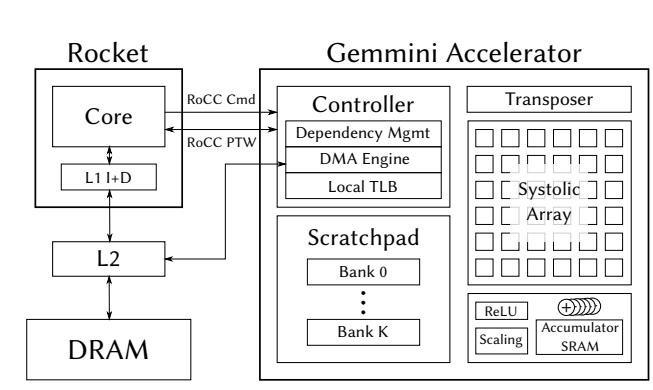

# Gemmini: An Agile Systolic Array Generator Enabling Systematic Evaluations of Deep-Learning Architectures

date create: 01.13.2020  
date update: 01.13.2020
```
From Wikipedia

In parallel computer architectures, a systolic array is a homogeneous network of tightly coupled data processing units (DPUs) called cells or nodes. Each node or DPU independently computes a partial result as a function of the data received from its upstream neighbors, stores the result within itself and passes it downstream. Systolic arrays were invented by H. T. Kung and Charles Leiserson who described arrays for many dense linear algebra computations (matrix product, solving systems of linear equations, LU decomposition, etc.) for banded matrices. Early applications include computing greatest common divisors of integers and polynomials.[1][failed verification] They are sometimes classified as multiple-instruction single-data (MISD) architectures under Flynn's taxonomy, but this classification is questionable because a strong argument can be made to distinguish systolic arrays from any of Flynn's four categories: SISD, SIMD, MISD, MIMD, as discussed later in this article.
 The parallel input data flows through a network of hard-wired processor nodes, which combine, process, merge or sort the input data into a derived result. Because the wave-like propagation of data through a systolic array resembles the pulse of the human circulatory system, the name systolic was coined from medical terminology. The name is derived from systole as an analogy to the regular pumping of blood by the heart.
```
- [Gemmini: An Agile Systolic Array Generator Enabling Systematic Evaluations of Deep-Learning Architectures](#gemmini-an-agile-systolic-array-generator-enabling-systematic-evaluations-of-deep-learning-architectures)
  - [- design space exploration](#ul-lidesign-space-explorationli-ul)
  - [introduction](#introduction)
  - [GEMMINI GENERATOR](#gemmini-generator)
    - [architecture](#architecture)
    - [parameters](#parameters)
    - [programing Model](#programing-model)
- [design space exploration](#design-space-exploration)
---
 abstraction

## introduction
because:
1. Hardware accelerators are a natural solution to the large computational requirements imposed by DNNs.
1. Accelerators can be used in various stages of the machine learning process: whether in training or inference, on edge devices or on the cloud. Each of these use cases applies different constraints on the accelerator, including latency, power, throughput, energy, area, programmability, and system integration.
1. the differences between edge inference and cloud training accelerators can be cast as different accelerator parameters rather than changes to the basic computational kernels


so:    
hardware generators [11, 12] are an attractive approach to building DNN accelerators.

parameters:  
Systolic array hardware generators should target pertinent architectural parameters such as **dataflow**, **pipeline depth**, **banking strategy**, **precision**, and **on-chip memory capacity**. Such generators also need to consider parameters for system-level integration such as **bus widths**, **off-chip memory bandwidth**, and **host CPU architecture**.
Accurately evaluating the generated system requires a high-fidelity simulator which can faithfully model systemlevel interactions with **operating systems**, **DRAM controllers** , **networks**, etc.

constraints:  
Many of these architectural parameters impact the **physical realizability**, as well as the **power**, **area**, and **maximum clock frequency** of the generated hardware.
Therefore, any generator needs to be evaluated not only on its architectural or RTL characteristics, but also on the full **physical design flow** which it enables.
## GEMMINI GENERATOR


### architecture
`C = A ∗ B + D`  
A and B are the multiplied matrices, C is the result and D is a bias matrix


### parameters
### programing Model
# design space exploration
    Evaluation method
    area and power
    performance
    design space analysis
physical design
discussion
related work
future work
conclusion