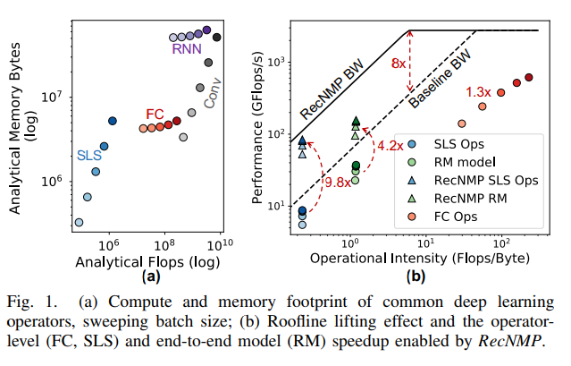

# RecNMP: Accelerating Personalized Recommendation with Near-Memory Processing

## abstract
```
Personalized recommendation systems leverage deep learning models and account for the majority of data center AI cycles. Their performance is dominated by memory-bound sparse embedding operations with unique irregular memory access patterns that pose a fundamental challenge to accelerate.
This paper proposes a lightweight, commodity DRAM compliant, near-memory processing solution to accelerate personalized recommendation inference. The in-depth characterization of production-grade recommendation models shows that embedding operations with high model-, operator- and data-level parallelism lead to memory bandwidth saturation, limiting recommendation inference performance. We propose RecNMP which provides a scalable solution to improve system throughput, supporting a broad range of sparse embedding models. RecNMP is specifically tailored to production environments with heavy co-location of operators on a single server. Several hardware/software cooptimization techniques such as memory-side caching, tableaware packet scheduling, and hot entry profiling are studied, resulting in up to 9.8× memory latency speedup over a highlyoptimized baseline. Overall, RecNMP offers 4.2× throughput improvement and 45.8% memory energy savings
```
1. **memory-bound sparse embedding operations with unique irregular memory access patterns**  
1.  **embedding operations with high model-, operator- and data-level parallelism lead to memory bandwidth saturation**
## intoduction
