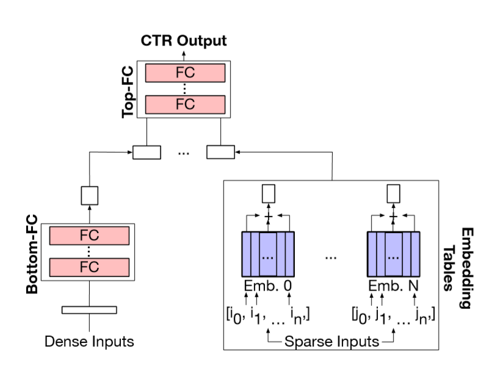

# Facebook's recommendation DNN system

## main system architecture:

## embeding tatble features:
 Due to their highly irregularmemoryaccesspatternandlow-computedensity,improvingtheefficiencyofembeddingtableoperationsrequires unique solutions, compared to the software and hardware acceleration approaches applied to FC and CNN layers.

