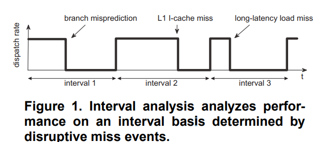

# Interval Simulation: Raising the level of abstraction in architectural simulation
## abstract
 By raising the level of abstraction, interval simulation reduces both development time and evaluation time
### accuracy
 * average error of 4.6% and max error of 11% for the multi-threaded fullsystem workloads
### fast
 * while achieving a one order of magnitude simulation speedup compared to cycle-accurate simulation.
### easy to implement
* our implementation of the mechanistic analytical model incurs only one thousand lines of code
---
## introduction
* The key challenge in raising the level of abstraction in multi-core simulation is how to cope with the tight performance entanglement between co-executing threads
* Branch predictor, memory hierarchy, cache coherence and interconnection network simulators determine the miss events;
* The cooperation between the mechanistic analytical model and the miss event simulators enables the modeling of the tight performance entanglement between co-executing threads on multi-core processors.

## interval Analysis(background)

